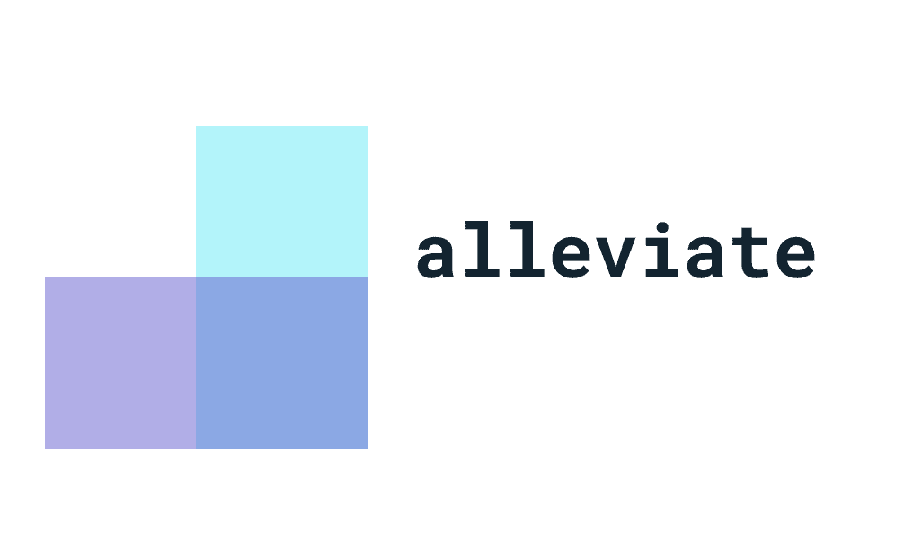

# alleviate

A lightweight Android library that wraps your work requests and ensure they will run approximately at the time you want it to.
This is done using a component called ForegroundTaskInfo that will be triggered when all work constraints are satisfied.

Check out my Medium post for clearer explanation about the problems this library tries to solve:
https://medium.com/@rotemmatityahu/workmanager-does-it-always-manage-to-work-fd8518655052

## Features
- Easy Foreground Service scheduling.
- Friendly API using DSLs and Java builder.
- Support custom logger.

## Usage
- Kotlin
```kotlin
fun scheduleForegroundTask() {
    val foregroundTaskInfo = foregroundTaskInfo {
        id = TASK_ID
        networkType = NetworkType.Any
        persisted = true 
        minLatencyMillis = TimeUnit.HOURS.toMillis(12) 
        timeoutMillis = TimeUnit.MINUTES.toMillis(1) 
        retryData = RetryData(retryPolicy = RetryPolicy.Exponential, initialBackoff = 4000) 
    }
    ForegroundTasksSchedulerWrapper().scheduleForegroundTask(
        ReposForegroundService::class.java,
        foregroundTaskInfo
    )
}

fun cancelForegroundTask() {
    ForegroundTasksSchedulerWrapper().cancel(TASK_ID)
}
```

- Java
```java
public void scheduleForegroundTask() {
    final ForegroundTaskInfo foregroundTaskInfo = new ForegroundTaskInfo.Builder().id(TASK_ID)
                                                                              .networkType(NetworkType.NotRoaming)
                                                                              .persisted(true)
                                                                              .minLatencyMillis(TimeUnit.HOURS.toMillis(12))
                                                                              .timeoutMillis(TimeUnit.MINUTES.toMillis(1))
                                                                              .retryData(new RetryData(RetryPolicy.Linear, 3000))
                                                                              .build();

    new ForegroundTasksSchedulerWrapper().scheduleForegroundTask(ReposForegroundService.class, foregroundTaskInfo);
}
```

## Initializing the SDK
```kotlin
class MainApplication : Application() {
    override fun onCreate() {
        super.onCreate()
        foregroundSdk {
            context = this@MainApplication // mandatory
            logger = CustomAppLogger() // optional 
        } 
    }
}
```

## Creating foreground task
```kotlin
class ReposForegroundService : ForegroundTaskService() {

    override fun getNotification(): Notification {
        // create channel
        val channelId = resources.getString(R.string.my_channel)
        if (android.os.Build.VERSION.SDK_INT >= android.os.Build.VERSION_CODES.O) {
            val notificationChannel = NotificationChannel(channelId, channelId, NotificationManager.IMPORTANCE_DEFAULT)
            notificationChannel.setSound(null, null)
            val notificationManager = getSystemService(Context.NOTIFICATION_SERVICE) as NotificationManager
            notificationManager.createNotificationChannel(notificationChannel)
        }

        return NotificationCompat.Builder(this, channelId)
            .setContentTitle(resources.getString(R.string.my_title))
            .setContentText(resources.getString(R.string.my_body))
            .setSmallIcon(R.drawable.ic_launcher_foreground)
            .build() 
    }

    // Called from a background thread
    override fun doWork(): Result {
        return try { 
            val repos = GitHubRepo(getNetworkService()).getRepos().execute()
            Result.Success 
        } catch (e: Exception) { 
            if (foregroundTaskInfo.retryCount >= MAX_RETRIES) { 
                Result.Failed 
            } else { 
                Result.Retry 
            } 
        } 
    }

    override fun onStop(stoppedCause: StoppedCause): Result {
        return when (stoppedCause) {
            StoppedCause.Timeout -> onTimeout() // called when timeout was reached according to ForegroundTaskInfo.timeoutMillis
            StoppedCause.ConnectionNotAllowed -> Result.Retry // called when connection type was changed while work is being executed
            StoppedCause.TerminatedBySystem -> Result.Failed // called when the system decided to stop the task while work is being executed 
        } 
    }

    private fun onTimeout(): Result {
        return if (foregroundTaskInfo.retryCount >= MAX_RETRIES) { 
            Result.Failed 
        } else { 
            Result.Retry 
        } 
    }
}
```

## Supported foreground task descriptors
```kotlin
val id: Int // mandatory
val networkType: NetworkType
val persisted: Boolean // survive reboot
val minLatencyMillis: Long // when to trigger the task
val timeoutMillis: Long // when to stop the task and remove the notification
```

## Supported network types
```kotlin
enum class NetworkType {
    None,
    Any,
    NotRoaming
}
```

## Supported backoff policies
```kotlin
enum class RetryPolicy {
    Linear, // retryCount * retryData.initialBackoff
    Exponential // (retryData.initialBackoff * 2)^(retryCount - 1)
}
```

## Download
Add this to your root build.gradle
```groovy
allprojects {
    repositories {
        ...
        maven { url 'https://jitpack.io' }
    }
}
```

Add this to your module's build.gradle
```groovy
dependencies {
    implementation 'com.github.ironSource:alleviate:1.0.0'
}
```
## License
Copyright (c) 2021 Rotem Matityahu

Permission is hereby granted, free of charge, to any person obtaining a copy
of this software and associated documentation files (the "Software"), to deal
in the Software without restriction, including without limitation the rights
to use, copy, modify, merge, publish, distribute, sublicense, and/or sell
copies of the Software, and to permit persons to whom the Software is
furnished to do so, subject to the following conditions:

The above copyright notice and this permission notice shall be included in all
copies or substantial portions of the Software.

THE SOFTWARE IS PROVIDED "AS IS", WITHOUT WARRANTY OF ANY KIND, EXPRESS OR
IMPLIED, INCLUDING BUT NOT LIMITED TO THE WARRANTIES OF MERCHANTABILITY,
FITNESS FOR A PARTICULAR PURPOSE AND NONINFRINGEMENT. IN NO EVENT SHALL THE
AUTHORS OR COPYRIGHT HOLDERS BE LIABLE FOR ANY CLAIM, DAMAGES OR OTHER
LIABILITY, WHETHER IN AN ACTION OF CONTRACT, TORT OR OTHERWISE, ARISING FROM,
OUT OF OR IN CONNECTION WITH THE SOFTWARE OR THE USE OR OTHER DEALINGS IN THE
SOFTWARE.
